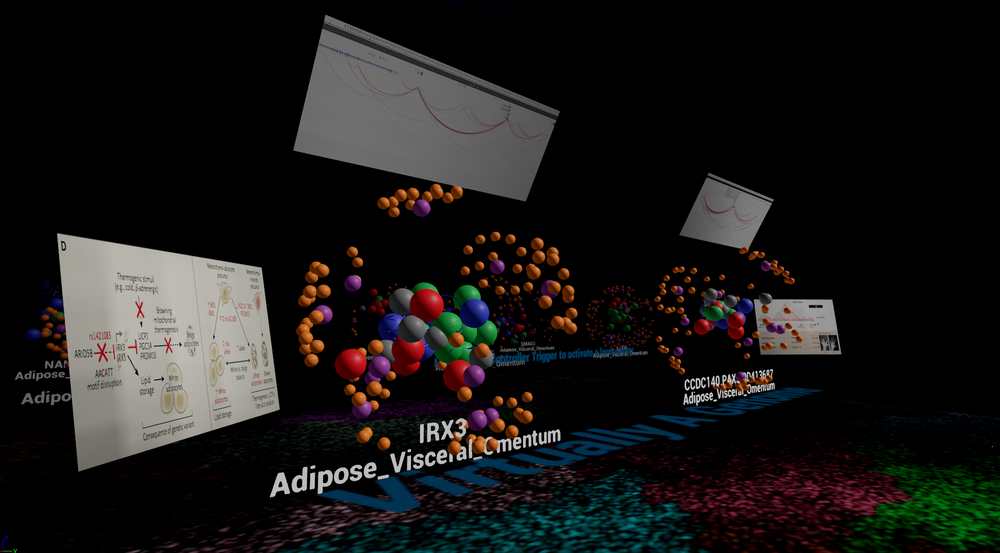

Virtually A Genome
==================

Project for the Reality Virtually Hackathon

The VirtuallyAGenome project was created to solve a real challenge that molecular biologists are facing. This tool allows the user to quickly and intuitively understand the relative locations and details of the sections of the genome they are investigating.

Currently Biologists visualize the genome in one dimension (1D) even though the genome is highly structured within the nucleus (~2 meters of DNA folded into a 6 micrometer diameter sphere, perfectly every time). Far away regions, upwards of 1.5 megabases, can loop closely to other regions and affect the expression of genes. This 1D viewing has led biologists to incorrectly assign disease causing variations which has in certain cases lead to millions of research dollars and decades of time being expended on incorrect assumptions.

Visualizing the genome in VR with relevant annotation provides an entirely new perspective, allowing for rapid assessments and predictions as to what variation causes disease. By viewing the molecules in 3D the user can quickly see which parts of the sequence are physically near each other, query the database using a hand gesture, and promptly receive feedback in order to aid their decision making process in a way that other technologies are unable to. 

The program was creating using DNA interaction research, large scale databases, machine learning, A-Frame, Unreal engine 4, and cardboard. Our team was composed of a computational biologist , a chemist, a VR developer, and a javascripter.
